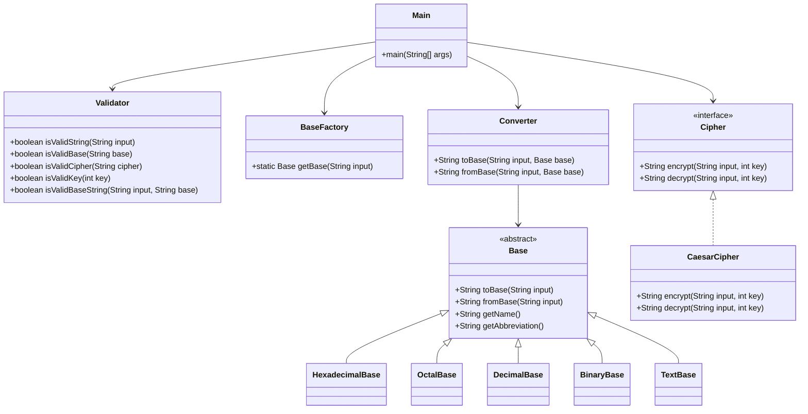

# Class Design – Global Converter

## Class Descriptions

### 1. `Main`
- **Responsibility:** Entry point of the application. Handles user interaction (CLI and interactive), command-line parsing, and coordinates the workflow between other classes.
- **Uses:** `Validator`, `BaseFactory`, `Converter`, `Cipher` (via `CaesarCipher`)

### 2. `Validator`
- **Responsibility:** Validates user input, including the string to convert, base options, cipher options, and keys. Ensures only valid data is processed by the application.
- **Key Methods:**
  - `boolean isValidString(String input)`
  - `boolean isValidBase(String base)`
  - `boolean isValidCipher(String cipher)`
  - `boolean isValidKey(int key)`
  - `boolean isValidBaseString(String input, String base)`

### 3. `Base` (abstract class)
- **Responsibility:** Abstracts the concept of a base (hexadecimal, octal, decimal, binary, text). Provides interface for conversion to and from the base.
- **Key Methods:**
  - `String toBase(String input)`
  - `String fromBase(String input)`
  - `String getName()`
  - `String getAbbreviation()`
- **Subclasses:**
  - `HexadecimalBase`
  - `OctalBase`
  - `DecimalBase`
  - `BinaryBase`
  - `TextBase`

### 4. `BaseFactory`
- **Responsibility:** Factory class to instantiate the correct `Base` subclass based on user input (name or abbreviation).
- **Key Method:**
  - `static Base getBase(String input)`

### 5. `Converter`
- **Responsibility:** Handles all conversions between text and numeric bases using the `Base` class hierarchy.
- **Key Methods:**
  - `String toBase(String input, Base base)`
  - `String fromBase(String input, Base base)`

### 6. `Cipher` (interface)
- **Responsibility:** Defines the contract for encryption and decryption methods. Allows for easy extension to support multiple ciphers.
- **Key Methods:**
  - `String encrypt(String input, int key)`
  - `String decrypt(String input, int key)`

### 7. `CaesarCipher` (implements `Cipher`)
- **Responsibility:** Implements the Caesar cipher algorithm for encryption and decryption of strings.
- **Key Methods:**
  - `String encrypt(String input, int key)`
  - `String decrypt(String input, int key)`

---

## UML Class Diagram (Mermaid)

