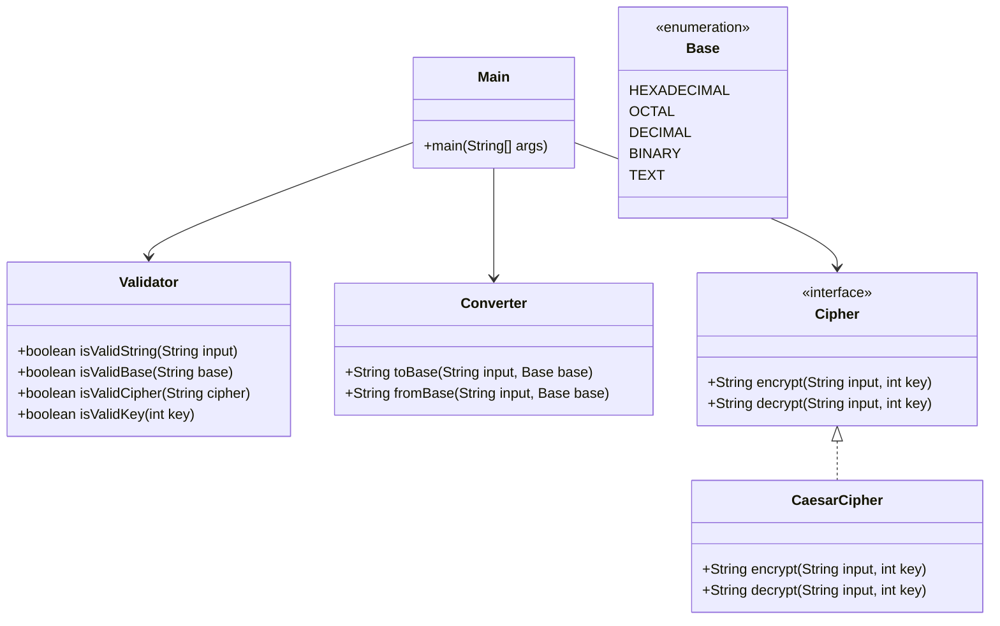

# Class Design – Global Converter

## Class Descriptions

### 1. `Main`
- **Responsibility:** Entry point of the application. Handles user interaction, command-line parsing, and coordinates the workflow between other classes.

### 2. `Validator`
- **Responsibility:** Validates user input, including the string to convert, base options, and encryption options. Ensures only valid data is processed by the application.

### 3. `Base` (enum)
- **Responsibility:** Enumerates supported bases (HEX, OCTAL, DECIMAL, BINARY, TEXT) and their short/long options. Provides mapping between user input and internal logic.

### 4. `Converter`
- **Responsibility:** Handles all conversions between text and numeric bases (ASCII ↔ hex, octal, decimal, binary, text). Implements conversion logic manually, without using Java's built-in methods.

### 5. `Cipher` (interface)
- **Responsibility:** Defines the contract for encryption and decryption methods. Allows for easy extension to support multiple ciphers.

### 6. `CaesarCipher` (implements `Cipher`)
- **Responsibility:** Implements the Caesar cipher algorithm for encryption and decryption of strings.

---

## UML Class Diagram (Mermaid)

